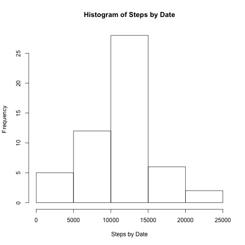

#I. Getting and Processing Data

I downloaded data from the Activity monitoring data set


```r
#download.file("https://d396qusza40orc.cloudfront.net/repdata%2Fdata%2Factivity.zip", "data.zip")
#unzip("data.zip")
data <-read.csv("activity.csv")
```

#II. Total Steps Per Day

First, I look analyzed the total number of steps per day.


```r
#Total Steps
dataComplete <- data[complete.cases(data$steps),]
totalSteps <- aggregate(dataComplete$steps, list(date= dataComplete$date) , "sum")
hist(totalSteps$x, main="Histogram of Steps by Date", xlab="Steps by Date")
```



```r
meanStepsPerDay <- mean(totalSteps$x)
medianStepsPerDay <- median(totalSteps$x)

#Format numbers for output
meanSteps <- formatC(meanStepsPerDay, format="d", big.mark=',')
medSteps <- formatC(medianStepsPerDay, format="d", big.mark=',')
```

The following histogram shows the frequency of steps per day. The mean and median steps per day is: 10,766 and 10,765 respectively.

#III. Average Daily Activity Pattern

Next, I look at the average daily activity pattern to compare intervals across all days.


```r
#Average Daily Activity Pattern
activityPattern <- aggregate(dataComplete$steps, list(interval = dataComplete$interval) , "mean")
plot(activityPattern$interval, activityPattern$x, type="l", 
     main="Average Daily Activity Pattern",
     xlab= "Interval",
     ylab= "Average Number of Steps per Day")
```


```r
#Max interval
maxInterval <- activityPattern[activityPattern$x == max(activityPattern$x), 1]
```

Interval 835 has the highest average activity.

#IV. Missing Values


```r
#Total Missing Values
dateNA <- nrow(data[is.na(data$date),])
intervalNA <- nrow(data[is.na(data$interval),])
stepsNA <- nrow(data[is.na(data$steps),])
```

The data set has 3 columns: steps, interval, and date and have the following total of NA cells respectively
  
  * 2304
  
  * 0
  
  * 0


```r
#Impute Missing Data
meanStepsList <- aggregate(dataComplete$steps, list(date= dataComplete$date) , mean)
names(meanStepsList)[2] <- "avgSteps"

dataWithDailyAvg <- merge(data, meanStepsList, "date")

#Replace NA values with daily average
dataWithDailyAvg[is.na(dataWithDailyAvg$steps),] <- dataWithDailyAvg[is.na(dataWithDailyAvg$avgSteps),] 
#Prove there are zero NAs
nrow(dataWithDailyAvg[is.na(dataWithDailyAvg$steps),])
```

```
## [1] 0
```

```r
totalStepsImputed <- aggregate(dataWithDailyAvg$steps, list(date= dataWithDailyAvg$date) , "sum")
hist(totalStepsImputed$x, main="Histogram of Steps by Date with Imputed Data", xlab="Steps by Date")
```


```r
meanStepsPerDayImputed <- mean(totalStepsImputed$x)
medianStepsPerDayImputed <- median(totalStepsImputed$x)

#Format numbers for output
meanImpSteps <- formatC(meanStepsPerDayImputed, format="d", big.mark=',')
medImpSteps <- formatC(medianStepsPerDayImputed, format="d", big.mark=',')
```
The following histogram shows the frequency of steps per day. The mean and median steps per day is: 10,766 and 10,765 respectively.

##Comparison to Original Data


```r
par(mfrow=c(2,1))
#Original data histogram
hist(totalSteps$x, main="Histogram of Steps by Date", xlab="Steps by Date")

#Imputed data histogram
hist(totalStepsImputed$x, main="Histogram of Steps by Date with Imputed Data", xlab="Steps by Date")
```


The mean does not change: 10,766 to 10,766

The median does not change: 10,765 to 10,765

#V. Weekday vs. Weekends


```r
#Create new factor variable for weekend/weekday
dateType <- weekdays(as.Date(factor(dataWithDailyAvg$date)))
dateTypeData <- mutate(dataWithDailyAvg, dateType= ifelse(dateType %in% c("Saturday", "Sunday"), "weekend", "weekday"))

dataWeekday <- dateTypeData[dateTypeData$dateType == "weekday",]
dataWeekend <- dateTypeData[dateTypeData$dateType == "weekend",]

par(mfrow=c(2,1), mar = rep(0, 4), oma=c(4, 4, 4, 2), las=1)
#Weekday Chart
activityPattern <- aggregate(dataWeekday$steps, list(interval = dataWeekday$interval) , "mean")
plot(activityPattern$interval, activityPattern$x, type="l", xaxt='n', ylab="", xlab="")

#Weekend Chart
activityPattern <- aggregate(dataWeekend$steps, list(interval = dataWeekend$interval) , "mean")
plot(activityPattern$interval, activityPattern$x, type="l", xlab= "", ylab= "")

#Format Panel
title(main="Average Weekday Activity Pattern", xlab= "Interval", ylab= "Average Number of Steps per Day", outer=TRUE)
```


The activity on the weeday peaks in the morning, but reamains low for the rest of the day while the activity on the weekends also peaks in the morning around the same time, but stays at that level throughout the day. This suggests that on average, there is more activity on the weekend than the weekday.
